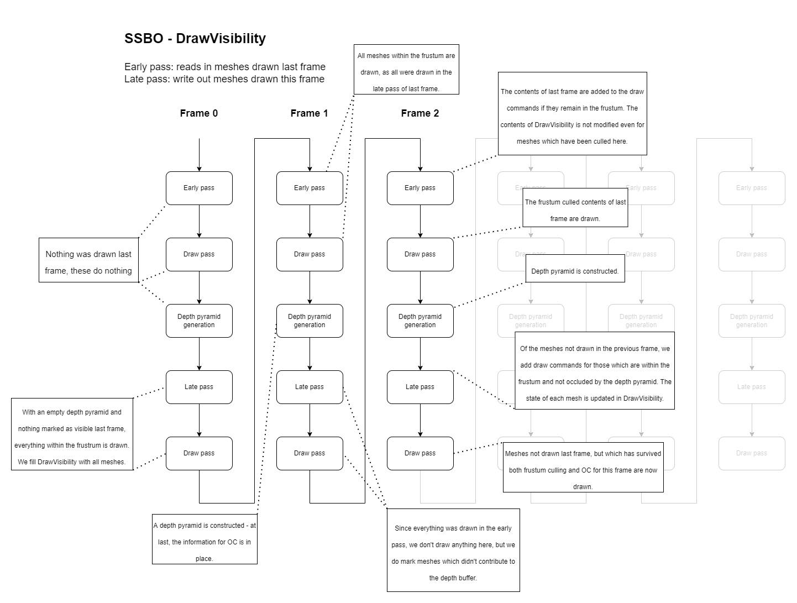

* Requires Vulkan SDK
* Should run on any platform
* Contains submodules
* Contains CMake, use that as you wish.

### Two-Pass GPU Occlusion Culling & Frustum Culling

This repoditory implements occlusion culling completely on the GPU using a two-pass method. The method is well documented by various blogs and playlists[1] [2] [3] [4], but I'll run through my exact implementation here as I've tried to not look at too many references.

First, a diagram of the occlusion culling flow:

* Early Pass
  * Adds every mesh which was drawn in the previous frame, as long as it remains potentially in the view frustum, to the indirect draw command buffer.
* Depth Pyramid Generation
  * Takes as input a Z-buffer (in this case, from the early pass), and produces a hierarchical Z-buffer (HiZ) as out.
  * Each mip level of the HiZ contains the previous level's information, but at half the size.
* Late Pass
  * Checks **_every_** mesh in the scene for visibility.
  * Visibility is checked against the frustum.
  * Visibility is checked by comparing the distance between the closest point on a given mesh and the camera to the HiZ generated from the early pass.
  * Marks **_every_** mesh as either potentially contributing to this frame's final pixels, or not.
  * **_Only_** draws meshes which are deemed to be potentially contributing to the frame's final pixels and haven't been drawn in the early pass already.
* The Draw Passes
  * The draw passes, in this repo's case, are a deffered rendering pipeline, with potentially some debugging output options.
  * `vkCmdDrawIndexedIndirectCount` is used to make the draw calls. The early and late passes write `VkDrawIndexedIndirectCommand` structures in to the indirect `commandBuffer`, as well as the `uint32_t` in to the `countBuffer`.
  * The G-buffers being used are:
    * Color (rgb: color, a: specularity)
    * Normal (rgb: normal)

#### Pipeline flow tl;dr
   * Frame 1:
     1. All potentially visible meshes are drawn in the late pass.
   * Frame 2:
     1. All potentially visible meshes from the last frame are drawn in the early pass.
     2. A useful HiZ is built.
     3. Any remaining meshes are drawn in the late pass.
   * Frame 3:
     1. Algorithm is now in full swing
     2. The early pass will draw contents of previous frame.
     3. The late pass will draw the contents which was missing from the early pass.

### Discrete LOD

TODO: Code is done, need to write about it.

[1]: https://medium.com/@mil_kru/two-pass-occlusion-culling-4100edcad501
[2]: https://interplayoflight.wordpress.com/2017/11/15/experiments-in-gpu-based-occlusion-culling/
[3]: https://blog.selfshadow.com/publications/practical-visibility/
[4]: https://www.youtube.com/playlist?list=PL0JVLUVCkk-l7CWCn3-cdftR0oajugYvd