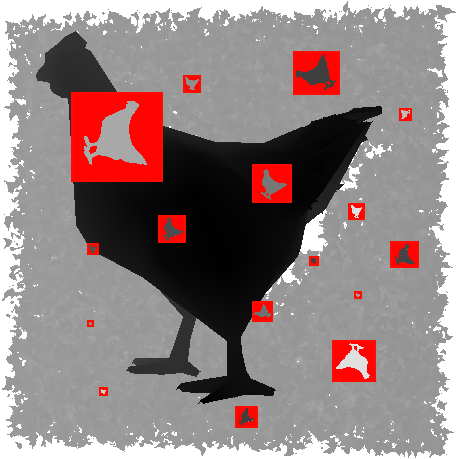
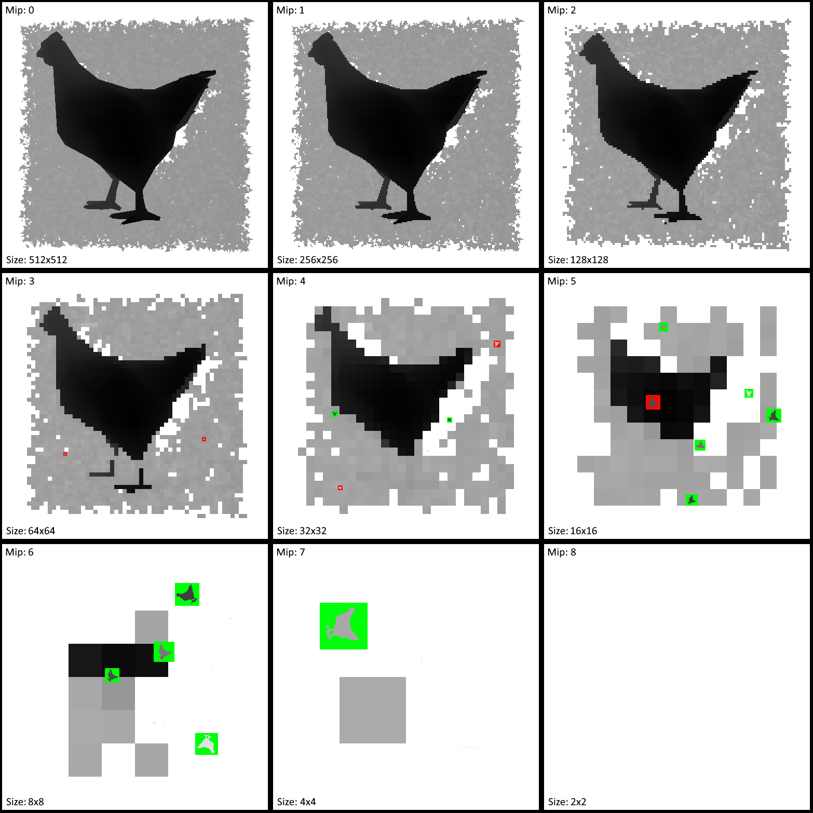
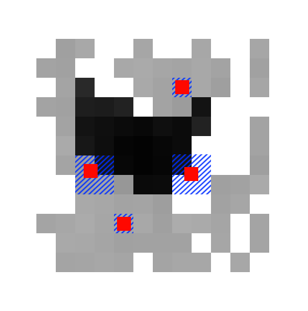

# Description
This repository is for me to try and improve my Vulkan development and graphics programming.

# Building
**Requires Vulkan SDK installed**

```
git submodule update --init --recursive
mkdir ../build_dir
cd ../build_dir
cmake ../many_chickens .
cmake --build .
cmake --install . --prefix=<your_install_dir>
<your_install_dir>/bin/app
```
# Two-Pass GPU Occlusion Culling & Frustum Culling

This repository implements occlusion culling completely on the GPU using a two-pass method. The method is well documented by various blogs and playlists<sup>[1] [2] [3] [4]</sup>, but I'll run through my exact implementation here with some pretty pictures.

First, a diagram of the occlusion culling flow:

<p align="center">
    
</p>

The algorithm consists of three major parts:
1. The early pass draws every mesh which could potentially have contributed to the the previous frame's final depth buffer, as long as they remain within the current frame's frustum. It's the previous frame's late pass' job to decide which meshes have potentially contributed to that frame's final depth buffer.
2. A hierarchical depth pyramid (HiZ) is generated using the depth buffer of the early pass. Each mip of the depth pyramid has the furthest depth from the 4 pixel in the level before it.
3. The late pass does two things:
   1. Iterates over _**all**_ meshes, updating whether or not they could have potentially contributed to the final depth buffer of the current frame. 
   2. Draws any meshes which weren't drawn in the early pass of this frame and could potentially contribute to the current frame's depth buffer.

### Worked Example

I will run through a worked example with images to try and illustrate the behaviour of this algorithm in practice.

The scene is 150,000 chickens, each with a few thousand polygons. One chicken is large and close to the camera, while the other 149,999 are randomly arranged within a huge cube further from the camera.

#### First Three Frames

Below is a table showing the behaviour of our algorithm for the first few frames. The algorithm takes a few frames to rev up, as it populates the HiZ buffer.

<p align="center">
    
</p>

1. In frame 1, because there have been no previous frames, the early pass does nothing. Following on, the depth pyramid is empty. All 150,000 chickens weren't drawn in the early pass, and could potentially contribute to our frame's final depth buffer, and so all 150,000 chickens are drawn.
2. In frame 2, all 150,000 were drawn last frame, and all 150,000 remain in frame, and so all chickens are drawn in the early pass. The first two frames will be extremely slow, drawing all meshes. Now that we have renders in the first frame, the HiZ is populated. In our case, 1.0 is our furthest depth, and 0.0 is our closest, so our depth pyramid performs `max` operations between each mip level. All 150,000 chickens were drawn in the early pass, and so none are drawn in the late pass. However, 29,619 are calculated to have minimum distances which are less than or equal to our depths in the depth buffer. We mark these as such.
3. In frame 3, we first draw the 29,619 chickens which were deemed to have potentially contributed to last frame's depth buffer, as all are still in frame. Since our selection in the last frame's late pass was conservative, when we come to generate our HiZ from the early pass, we happen to have our full and correct depth buffer in this frame's HiZ stage. Of the 120,381 chickens not drawn in this frame's early pass, none are closer to the camera than what is already in their HiZ coordinates, and so none are drawn.

At this stage, the third frames is fully revved up, and the rest of the program performs this loop.

#### Frames `n` and beyond

The previous worked example was to illustrate the algorithm's rev up period. The table below aims to illustrate the algorithm after the first three frames, and while the camera is moving and panning (chickens could also be moving, but are not in this example). 

<p align="center">
    
</p>

1. We start in frame `n`, where we left off in the previous table; the algorithm is not moving, and so we are drawing all of our visible chickens in the early pass, and as such, none of the remaining chickens are drawn in the late pass.
2. In frame `n+1`, we have just moved the camera, as well as panned a bit. In the early pass, all 29,619 chickens from our previous frame are drawn, but because of our camera's transformation, we can see gaps in our mesh - there is work to be done to fill these gaps.
   * First our HiZ is built from the early pass's depth buffer. * The late pass then compares the 120,381 chickens which weren't drawn in the early pass against the HiZ, to see which have a closest point which is closer than the depth in the depth pyramid.
   * 25,462 pass this test, and all of those remain in the frustum - these are drawn.
   * It's possible that some chickens from the early pass have also been occluded this frame (behind the big chicken's head for example), and these are marked as such.
3. In frame `n+2`, the early pass draws all of the chickens in frame `n+1` which:
   * Were drawn in the early pass **and** are not now known to be occluded.
   * Were drawn in the late pass.
4. The algorithm continue until frame `n+3`, where moving has stopped, and the algorithm stabalises to drawing all 35,819 potentially visible chickens in the early pass, and none in the late pass.

### Why HiZ?
I am yet to explain why we're using a hierarchical depth pyramid. Lets look at what we're testing in the late pass. Below we have:
* Our non-hierarchical, Average Joe depth buffer, generated from our early pass.
* A selection of 16 chickens from a hypothetical collection of chickens which weren't drawn in the early pass. The late pass is processing these to try and work out which should be drawn or not.
* A screen-space axis-aligned bounding boxes (SSAABB), for each of our 16 chickens we'll be following in this example (really, all 150,000 chickens will go through this process).

(This selection of chickens is not a real selection from our previous worked example. This set has been made to better illustrate the purpose of HiZ)

<p align="center">
    
</p>

So what do we need to check here? Well, for every pixel that each of our SSAABB covers in the depth buffer, we'd need to ask "is our chicken's depth at this point closer to the camera than the value in the depth buffer below?". This may seem reasonable at first, but here's what's actually happening:
* Each of these SSAABBs is a different size, ranging from 49 to 8280 pixels in area.
* All of this runs on a GPU, with each chicken runing through one thread. GPUs are best suited to doing exactly the same code for all threads in a wavefront/workgroup.

This has two issues:

* Larger chickens could potentially have to perform quite large loops over all their SSAABB's pixels.
* With each thread in a wavefront/workgroup having to work on pixel areas of different sizes, there will be serious slowdowns as the GPU as to manage this.

So, how do we reduce the number of samples taken for each chicken, and ensure that the same number is taken for each chicken? HiZ is an answer!

We first create a mipmapped image, where each mip has half the dimensions of it's predecassor. Each pixel in mip `n` is the furthest value of the the 4 pixels which inhabit the same space in mip `n-1`. This mean that as we move up the mips, each pixel represents a conservative value for all the pixels which have contributed to it. This is shown in the image below.

<p align="center">
    
</p>

Also illustrated on the image above is how we sample our depths in the late pass.

For each chicken we are processing we:
* Calcluate the distance to nearest point to the camera.
* Calculate the dimensions of the SSAABB.

The actualy calculation which is performed for each chicken, regardless of size, is:

**At each corner of the chicken's SSAABB, is the point on the chicken which is closest to the camera, closer than the value sampled at the same position from the HiZ's mip with pixel sizes only just large than the SSAABB's largest dimension?**

In code this looks like:

```
// screen space width and height of our AABB
float width = (aabb[0] - aabb[2]) *  ubo.win_dim.x;
float height = (aabb[1] - aabb[3]) *  ubo.win_dim.y;

// mip level of our input depth pyramid texture
level = uint(floor(log2(max(width, height))));

// Sample each corner of our AABB in the depth pyramid
float original_depth = textureLod(in_depth_pyramid, vec2(aabb[2], aabb[3]), level).x;
original_depth = max(original_depth, textureLod(in_depth_pyramid, vec2(aabb[0], aabb[3]), level).x);
original_depth = max(original_depth, textureLod(in_depth_pyramid, vec2(aabb[2], aabb[1]), level).x);
original_depth = max(original_depth, textureLod(in_depth_pyramid, vec2(aabb[0], aabb[1]), level).x);

// convert our sampled depth to view space
float linearlized_depth = linearize_depth(original_depth, 1.0, 250.0) - ubo.z_near;
// mesh's closest depth in view space
float depth_sphere = (pos.z - radius - ubo.z_near);

potentially_visible = depth_sphere <= linearlized_depth;
```

And with this we achieve only 4 samples per chicken, which conservatively identifies potentially visible chickens (with some false positives, but better than false negatives!).

We make 4 samples, as each SSAABB, at a mip whose pixels are only just larger than the largest dimension of the SSAABB, may influence the depth of up to four of the HiZ's pixels, as is shown in the image below.

<p align="center">
    
</p>

[Here is a video of culling](https://youtu.be/GZQd4QkHUr4)

[](https://youtu.be/GZQd4QkHUr4)

# Discrete LOD

This is a relatively simple algorithm. At the moment I use [meshoptimizer](https://github.com/zeux/meshoptimizer)'s `meshopt_simplify` to generate a single vertex buffer, and multiple index buffers for each of my LODs. In a compute pass I then select which lod to draw based on the size of the mesh in screen space. I calculate this in the late pass of the culling algorithm above, and then write the LOD to select from to a buffer for the early pass to read from.

[Here is a video of LOD + culling](https://youtu.be/TTz6j78JBPU)

[](https://youtu.be/TTz6j78JBPU)

[1]: https://medium.com/@mil_kru/two-pass-occlusion-culling-4100edcad501
[2]: https://interplayoflight.wordpress.com/2017/11/15/experiments-in-gpu-based-occlusion-culling/
[3]: https://blog.selfshadow.com/publications/practical-visibility/
[4]: https://www.youtube.com/playlist?list=PL0JVLUVCkk-l7CWCn3-cdftR0oajugYvd
